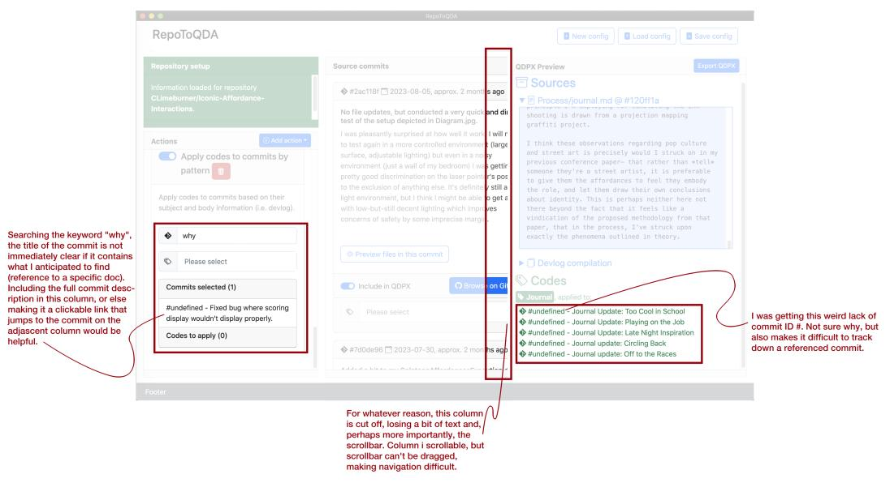
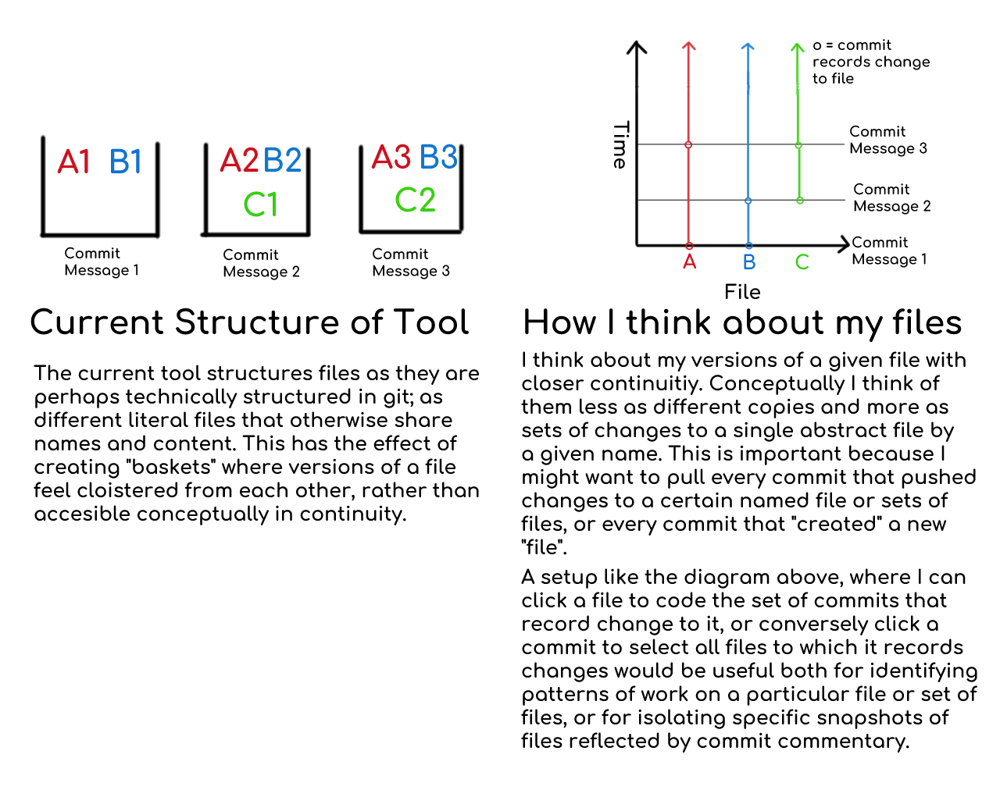

# Analysis workshop 01

## Preparation (2023-10-05)

I tweaked some of these based on the questionnaire about QDAS learning strategies and usability notes from @freitas2019 and general methodological questions raised in another source [@gilbert2014].

- Context: informal, preliminary impressions, early use of prototype.
- Data collection: audio recording; Zoom recording;

### Briefing questions

1. What data points or sources do you plan to include?
2. What sources do you expect to relate to a single version or multiple version?
3. What do you expect the balance in your data to be (between design artifacts and process docs)?
4. What main characteristics do you associate with the data you have in the repo?

### Things to observe during use

1. Observe which features users are engaging with more / less
2. Note which errors are happening
3. Validate the main actions and areas of the interface
4. Note surprises that might emerge

### Debriefing questions

1. Did your perception of the main characteristics you associate with the repo data change in any way?
2. Did using the tool change / suggest / block the data you ended up including?
3. Did you find new gaps you in your data?
4. What were the main points of friction in using the tool?
5. Did you have any ideas or insight about your data or analysis process while using the tool?
6. How do you rate the process of including the sources you expected?

## Post meeting notes (2023-10-06)

Overall, the workshop went quite well. I ended up doing a longer demo at the start (around 20-25min) to give an overview of the tool, its purpose and general functions. Then, we discussed the briefing questions and instructed folks to open a repo of their own and select data, reflecting on their process. This stage took around 12-20min. Finally, the debriefing moment took around 30min. We discussed a variety of insights, usability questions and reflections from participants. The workshop was recorded (as Zoom meeting and audio file in-person). Here are my [handwritten notes (scan)](_external/20231006-analysis_wksp_01_notes.pdf) and a [a copy of my audio recording](https://drive.google.com/open?id=1Ljm12fMr8dj7cvhJ87uDv99qcOff_hx3&usp=drive_fs) . The [transcript for the debriefing discussion can be found here](https://drive.google.com/open?id=1Lmc4bYEa7qOcEeBC3sXVU9lTZLBPL-It&usp=drive_fs).

### Feature ideas

1. Copy commit timestamp to sources
2. Some way to include all files from a commit (i.e. toggleable root folder) like the latest ones
3. Configurable text source file extensions
4. Export results as folder with ready-to-import files instead of QDPX
5. Improve collapsing / filtering of files in previews
6. Click on a commit number to scroll to that commit in the timeline {I think this is high priority}

### General comments & feedback on friction

1. F.: Noticed differences in tone between different data sources (commit msgs and journals)
2. O.: Asked for more file extensions to be compatible, so that his project files can be imported { this should be a settings option }.
3. Several: The amount of space and the slow downloading of data, with too much free space being taken over. This was an important limitation. Some participants ran out of space or the data download just blocked up and didn't work.
4. R: Issues between copying the GitHub full link or just the `user/repo` slug.
5. C: Issues with case-sensitive pattern searches, which made filters seem more strict than expected.
6. L: File preview being expanded by default makes it hard to have an overview.

### Debriefing summary (starts at aprox. 45:00)

1. _Q. Did your perception of the main characteristics you associate with the repo data change in any way?_
   1. F.: Noticed the tone differences between journal notes and commit msgs. R. noted that seeing both in the same UI helps that to happen.
   2. C.: The tool blocked the usual access to the way they framed the project materials and notes, both via problems that happened or just the presentation itself. There were issues with text rendering, scroll behaviors and incompatible views. { Tool creates a different frame, one that might be incompatible to initial designerly frame. }
   3. L. Used empty commit msgs as starting point and as a sign that more digging into different traces might be useful for understanding what was happening at that point.
2. _Q. Did using the tool change / suggest / block the data you ended up including?_
   1. F.: Yes, expected more journal entries, but ended up balancing more with commit msgs and other files.
   2. O.: Created a mix of sources about features and sources about documentation, use of codes to periodize and mark stages of process, started elaborating an initial codebook.
   3. L.: No big changes of plan, more of a step of filtering.
   4. P.: Raised the question about using this to update the materials in an on-going analysis project. { A possibility is to export as formatted source files ready to be imported, but that will lose codes. }
   5. C. wanted to include files from TouchDesigner, but those are node-based editors. There was somediscussion about how to approach this kind of material (e.g. screenshotting and committing) via practices or maybe via plugins.
3. _Q. Did you find new gaps you in your data?_
   1. O.: There were gaps in meaningfulness, lots of commits that did not seem meaningful. Discussion mentioned that having prompts or a practice to mark the need for more elaboration in documentation. There was also some discussion about sparse messages and what data to include when msgs are not enough.
4. _Q. Did you have any ideas or insight about your data or analysis process while using the tool?_
   1. Not discussed.
5. _Q. What were the main points of friction in using the tool?_
   1. This was not answered directly due to lack of time, but info is on the general notes above.
6. _Q. How do you rate the process of including the sources you expected?_
   1. It was not asked due to short time.

### Feedback from Chip (2023-10-07)

> Enric Granzotto Llagostera, here are both a screenshot of the tool with some observations of snags/bugs I encountered, and a sketch of a tool structure that, at least I, would find schematically easier to use. Effectively, instead of thinking about the repo contents as a series of commit "baskets" each containing loosely analogous versions of a set of files, being able to structure contents as a set of files changing over time with changes being seen by commits would be helpful for examining specific files across their lifetime, and for extracting relevant altered files from a commit snapshot. To my mind, this gives a much more direct view of longitudinal relationships between commits and cross-sectional relationships between files.

