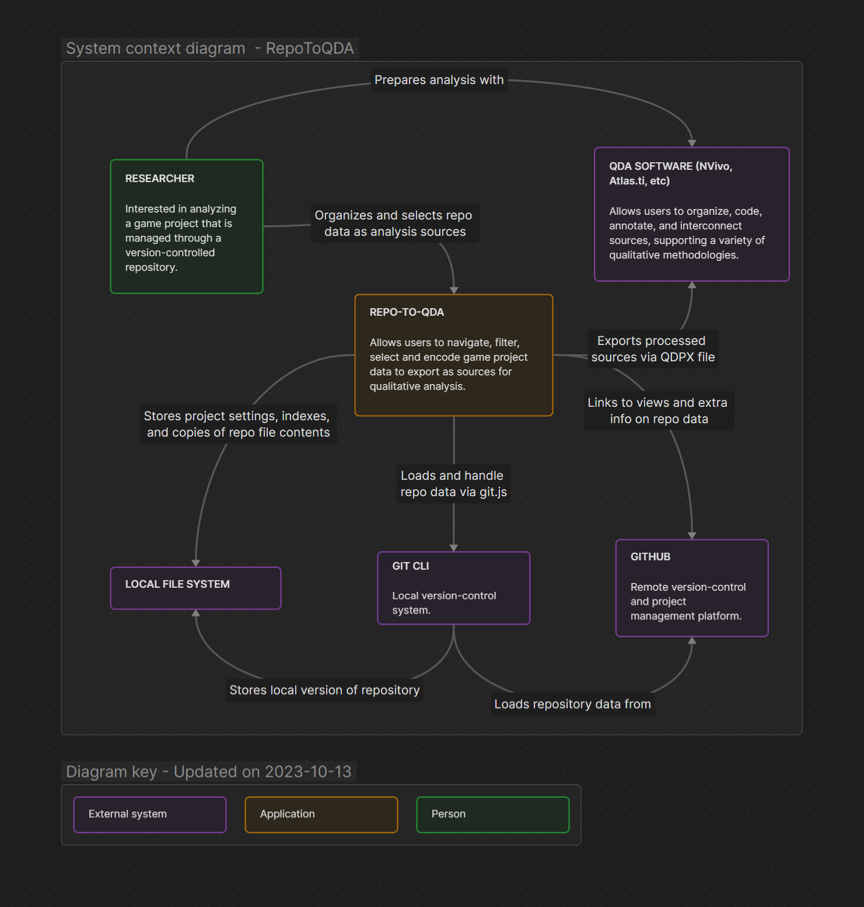
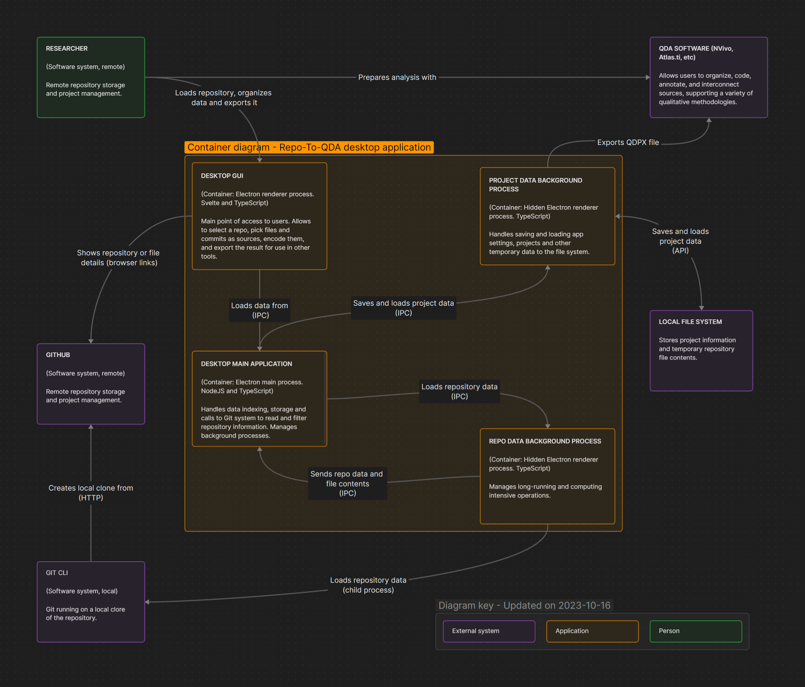

# 16 Rethinking the app and system architecture

As I deal with the scale and performance issues that happened during the 1st workshop, I'm also doing some architectural sketches of the system. I want to be able to have separate modules for storage of data and for presenting it, so that any changes needed in those system areas are more encapsulated. So far, the app software architecture was more focused on getting nasic versions of functionality going, to test them out and validate the design. It is not very robust.

I'm using the book @brown2012 as a basis, ant the following diagrams use the [C4 model](https://c4model.com/) Brown proposes. I think it is a clear modelling system with boundaries that make sense to me (internal / external systems, then executable processes, then major functionality responsibilities).

## System context diagram

Outlines major systems and users involved.

## Container context diagram

Outlines the main executable processes that are under the system responsibility. In this case, I separated the various renderers and the main processes of the desktop app (made with Electron), as they run somewhat separately and use IPC to communicate.

I'm trying to convey here how a lot of the data processing will need to happen somewhat independently from the main process. It seems that the main purpose of the main process in more complex Electron apps is to be that orchestration central hub, Processing and long-running systems should be run on separate threads, through a variety of implementations (ServiceWorkers in renderers, [worker processes as hidden windows](https://www.electronjs.org/docs/latest/tutorial/message-ports#worker-process), UtilityProcess and [other options](https://www.electronjs.org/docs/latest/tutorial/multithreading)).

## Component diagrams

TBD.
