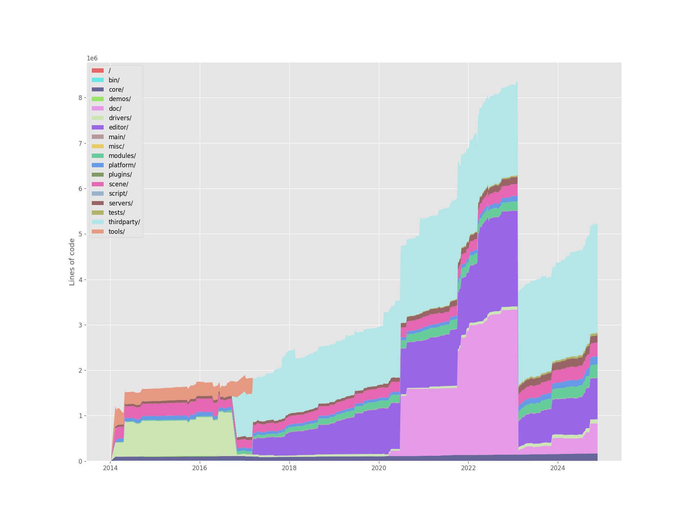

# 23 Analysis and information design

## Other Git analysis tools, or what could we learn from quantitative tools?

Quantitative often have a productivity focus that aims to manage and increase business value through surveillance and "metrics" for industrial management and rationality. Examples: [Code Climate](https://codeclimate.com/), [GitClear](https://www.gitclear.com/).

Smaller quantitative analysis tools also often present productivity oriented models, such as tracking and visualizing contributions over time, burndown charts. Examples of such tools: [git-quick-stats](https://github.com/git-quick-stats/git-quick-stats?tab=readme-ov-file#screenshots), [git-stats](https://github.com/IonicaBizau/git-stats?tab=readme-ov-file#cloud-installation), [git-of-theseus](https://github.com/erikbern/git-of-theseus), [hercules](https://github.com/src-d/hercules). Some of the quantitative metrics, however, can be illuminating to qualitative analysis. This would mean using them together with a key epistemological approach: taking features of quantitative data as potential areas for investigation instead of evidences of significance in themselves.

One such analysis technique that shows potential is the **cohort survival stack plot**, as generated by **git-of-theseus** and **hercules**. This graph shows the number of lines of code (LoC) added each year-of-addition or folder "cohort" and how they remained in the project as the time passed (their "survival"). As an illustration, I added an example below of running `git-of-theseus` at my **Cook Your Way** project and at the **Godot engine** repo.

_CYW's cohort survival stack plot (quick generation)_

_Godot engine's cohort survival stack plots, by year of code addition and by top-level project folders (took about 8 hours to analyze + generate)_

The graphs suggest ways to uncover design changes and patterns over the creation process. Some possibilities are:

1. Large swings in LoC numbers at particular moments might point to changes of design, governance, organization or implementation, and might be interesting moments for a more fine-combed qualitative investigation.
2. Mostly cumulative survival could suggest stability in design and a consistency in adding new features that might give a sense of an incremental process.

A variation of this kind of graph that I believe would be particularly useful is to show the evolution over time for particular folders (or groups of folders) within a repository. So, it could be possible for instance, to check the change over time and the continuity of particular areas of interest (e.g. codebase, concept art, design documentation, reference research). **git-of-theseus** already has a directory graph but only for the top-level folders of a repository.

## Visualization of Git processes

Most of the project we have been using as analysis subjects so far are mostly linear and use a single Git branch for development. This is not often the case in game development and software projects, and our visualization and presentation of data need to account for that the extent that it helps understand the design process.

A challenge of using Git so much is to understand what is the role of a commit and other Git operations (e.g. branching, merging) in relation to the development context. The tool **git-sim** ([repository here](https://github.com/initialcommit-com/git-sim)) could help with that, as it generates animated or static diagrams of different git operations. This could be embedded at the commit summary file or on the blogroll view to help contextualize commits within the project management structure (both at a local or more global levels) and where they fit there.

## Information design, performance, and choices

### Using a database

The data management approach I took with Ponte so far has been very basic, and not very optimized or resilient. That is ok, as I focused on creating UI and functionality for us to understand the tool we were building. However, this is starting to become a bottleneck in terms of performance, errors, and limiting the kinds of design projects we can analyze with the tool.

### A project format with a portable database

Keep the database with all the data needed as a file that is bundled with some Ponte metadata (in a JSON file) and zipped together (a bit like QDPX itself and Word documents). This would allow for very portable project format, one that is modular in relation of tool/user settings and the base data itself, but it might end up being a big file for larger Git repos.

The project database would be copied from the imported project to a temp location and be used and changed from this location. When saving the Ponte project, this version of the DB would be serialized and copied to the user's save location.

[Linked project information diagram](../20241118--data-management.canvas)

### Open questions

1. Do we require users to always have a clone of the repo when working with Ponte or could all the data needed be already in the database and the clone only be used temporarily?
2. How much do we front-load Git processing or do we perform it when requested by the users?
   1. As an example, copying or looking at file contents at specific commits is something that we use the cloned repo to do.
   2. Fornt-loading all the data importing and processing could take a long time for large repositories. We would need to make that process more transparent and visible for users.
3. Would a database-centric approach set us up to duplicate too much of Git's functionality and also potentially introduce errors? Git is quite optimized itself, so this might be the path to something that is not performant for larger projects.
