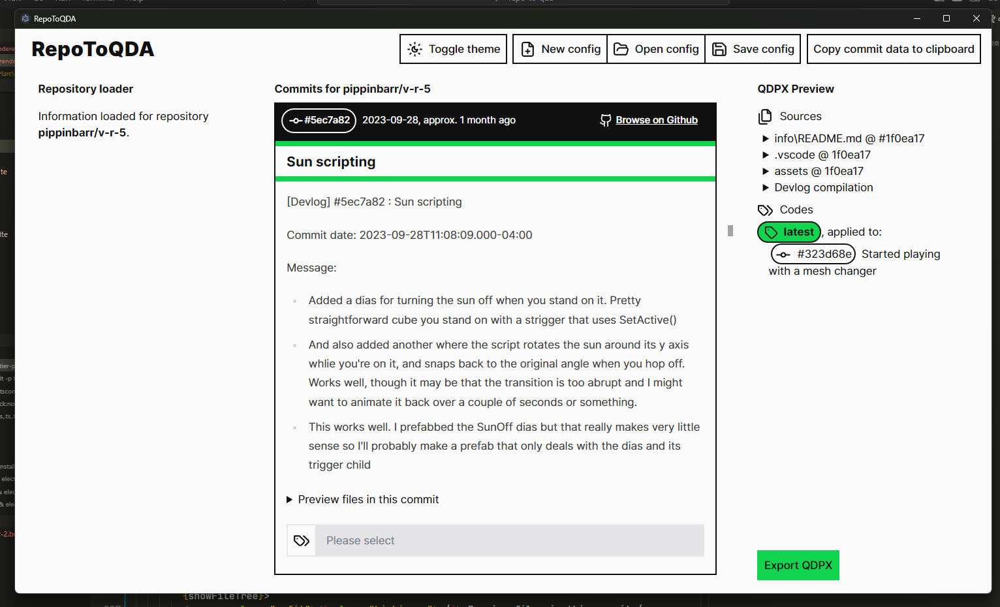
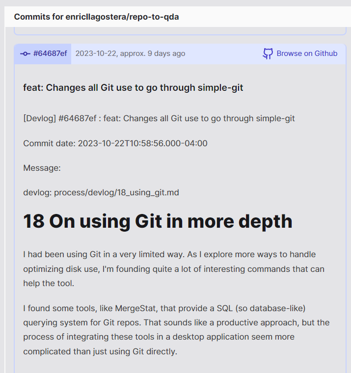

# Process journal

## 2024-03-25 Timeline info toggles

(timestamp::2024-03-25T14:48:23-04:00)

I'm adding the toolbar toggles to show/hide different info (author, branches, tags, files, lines) from all the timeline nodes. I think this would be a simple and effective way to control a bit the visual density of this display. I'll probably end up reusing the `ToggleGroup` component builder from MeltUI. (...) I'm happy that this is working quite well. Performance is still too slow, but the functionality is there.


## 2024-03-19 Fixing bugs and some zooming issues

(timestamp::2024-03-19T17:05:07-04:00)

OK, just got the loading of tags from configs to work with the `TagsInput` component, finally. It is getting recalculated too often, but I think it won't be much of a problem as I'm using an early return before the larger calculation. Moving on to improving the timeline zooming.

(timestamp::2024-03-19T18:12:44-04:00)

The 3-level zoom is implemented. I think it feels easy enough to use. Maybe the default level (100%) is too large? I should check with folks what they think.

## 2024-03-18 Show tags and branches in timeline view

(timestamp::2024-03-18T11:41:05-04:00)

This is for the medium density version. I just added the info as a kind of list of pills with icons after the main commit subject. Below is an example of how it looks. I also added the author info. This already works quite well, but it does make the boxes too tall, so I'm thinking of adding some form of toggling, similar to the file and line changes info, so that users can choose to show or hide these different pieces of info. I think a general toggle for the whole timeline would be enough, instead of per-commit toggles. There is still a bug with loading tags from config files, but I'll add it to the fix-it list for later.


## 2024-03-15 Continuing timeline redesign

(timestamp::2024-03-15T14:18:44-04:00)

I'll begin today's session by implementing the view-switching functionality. That will make it much easier to explore things back-and-forth between the views.

(timestamp::2024-03-15T17:32:25-04:00)

OK, got quite a lot done. The context-switching between the blogroll and the timeline is working well, also the new focus on the commit subject in the timeline node looks nice.

## 2024-03-12 Timeline redesign

(timestamp::2024-03-14T12:02:51-04:00)

I managed to re-organise the horizontal scale of the timeline view so that instead of having a continuous 1:1 mapping of time to x position, the x position is mapped to specific time units. Basically, this allows for a few interesting things: 1) a "natural" breakpoint between vertical and horizontal placement of nodes, as they go back to the top on a new time block; 2) the daily, weekly, bi-weekly and monthly units are all very familiar and feel intuitive to use, allowing for better understanding of the passage of time and rhythms of development.

Now, I'm thinking about how and what to display in order to have visualizations with different information densities. Right now, as the columns are quite wide, there is only so much that can fit in the view, so it is hard to prioritize what information to show. I have scheduled a chat with Shahrom so that we can continue discussing ideas for this redesign in order to figure out priorities and how to elaborate on them. There is a balance that is needed between context-switching, tagging, metadata information, and ways to identify commits among others.

## 2024-03-12 Full-text devlog search in blogroll

(timestamp::2024-03-12T15:52:03-04:00)

I'm quite happy this feature didn't take too long to implement. This makes it possible to search for matches when filtering commits using the whole commit message and the added devlog, when using external-file devlogs. This kind of quick filtering feels very at-home to me, maybe because I'm used to search systems that allow this querying. It might be pretty useful when trying to tag all instances of particular keywords associated with a preliminary theme or idea. For instance, when I tried it with the Ponte repo, I found a few repos that used the idea of "noisy" and it made me think this could be a useful theme when discussing the design later.

## 2024-03-11 Export panel improvements

(timestamp::2024-03-11T17:15:26-04:00)

Made some small changes to how the sources list shows items. I want to add a few "remove source" buttons later.

## 2024-03-07 to 08 Export panel redesign

(timestamp::2024-03-08T10:47:40-05:00)

Following up from yesterday, the redesign of the export panel is coming along well. While working on it, I noticed it is becoming pretty clear that the `inView` way of loading the blogroll progressively does not work well enough. It feels very janky and something like [pagination](https://melt-ui.com/docs/builders/pagination) might be better than the current "seamless" infinite loading.

## 2024-03-06 Blogroll layout fixes

(timestamp::2024-03-06T16:20:54-05:00)

Did a bunch of layout fixes. Flexbox is pretty frustrating sometimes, in order to get the stretching and overflows working as I wanted. I think it is mostly done now and the posts should be more readable and predictable.

## 2024-03-05 Filter blogroll by commit subject

(timestamp::2024-03-05T15:23:41-05:00)

Added a basic implementation, with a filter input and a clear button. This is already a pretty useful way to quickly check subject lines for important keywords. However, just the subject line might be too narrow a search scope, leaving out info about commits that is in the body of the message or in a devlog. So, later I'll add a toggle to choose to search within the shole message plus devlog. That way we can leverage conventional commit prefixes with the narrower search or more open-ended and exploratory full-text-like searches.


## 2024-03-04 Blogroll rework

(timestamp::2024-03-04T18:38:15-05:00)

I started implementing a blogroll version that shows both the changes in that commit and the file structure. It is an attempt at a more concise presentation and also with more space for metadata and details. It is roughly similar with the mockup I made back in [2024-02-21](#2024-02-21%20Some%20panel%20re-org). It is mostly working now, I just need to show the diff files properly (right now I'm only showing the complete file tree correctly).

(timestamp::2024-03-04T20:18:21-05:00)

The changed files and file tree work well. I probably should add a checkbox to add/remove the file as a source directly in the file changes panel, but that can come later.


(timestamp::2024-03-05T10:34:30-05:00)

Did a pass with some color coding for the different operations plus the "explore diff on GitHub" link.


## 2024-02-26 and 28 Improving the timeline implementation

(timestamp::2024-02-26T14:00:00-05:00)

I did some hours of work in getting the CSS and formatting of the timeline view to be more consistent. Basically, it now repositions the different commit nodes based on `grid` rows, which automates some of the positioning math I was doing at any change of visualization.

(timestamp::2024-02-28T15:58:23-05:00)

I'm trying to improve the timeline component but it still feels kind of janky. I think the key reason for that is how it is left aligned with the time axis so that I have no flexibility in positioning them along the horizontal axes. I am thinking of trying to create a more condensed view horizontally by making the component more vertical and make the text only appear on mouse over or when you select a commit. That way it might be possible to have a more horizontally condensed timeline but at the same time have enough visual information to explore it better.

## 2024-02-23 Notes after meeting

- L: Timeline with teams, like multiple gels or layers of different users.
  - R: Triangulation and getting a different perspective.
  - C: Shifts in views as sliding scale.
  - L: Grouping of commits, topological mappings.
- E: Filters to the timeline view as helping with this kind of exploration.
- C: Default tagging rules and an incipient codebook across GaR repos.
  - K: Developing a shared codebook through group work.

## 2024-02-21 Some panel re-org

(timestamp::2024-02-21T18:47:45-05:00)


(timestamp::2024-02-22T16:28:56-05:00)


I think this idea of the sources as small files to the left makes a lot of sense. The metadata information gives a reminder of how this source was created. Finally, the annotation as a last detail to the right also makes sense, and keeps complexity to a minimum by only allowing one annotation per source. I'll probably also have to create some kind of quick edit or quick annotation buttons to the list of sources. Also some kind of bulk action system using checkboxes might be useful as well. Another feature that might be useful would be to show a small notification toast at the bottom of the screen or at the top when a source is added to the project with a link to click and see it in the export preview panel.

## 2024-02-21 Improving tag inputs

Currently, tag inputs are fiddly and do not use the same system as other elements. I plan to migrate them to use the Melt UI library, as it will hopefully make it easier to re-use it in different contexts (e.g. commits and files). (...) I think I managed to get it working ok, but it does not have an autocomplete system yet. This is not supported by Melt UI right now. It would be really useful, but I'll leave as-is and add that functionality once the underlying library supports it. Keyboard navigation and correction is much improved from the previous implementation, so that's already useful.

## 2024-02-20 Drawer toggles

Today I implemented the on/off buttons for the two information drawers that are attached to commits in the timeline graph. It took me much longer than expected, as I had to refamiliarize myself with the codebase after a couple of months without using it much. In late January and February I worked on preparing a conference submission about the tool, and that took time out of the development side.

## 2023-12-08 A brief hiatus

The last couple weeks I ended up working less hours than expected in the GAR project in terms of coding and features or planning them. Part of that was because of the focus on dissertation work and getting closer to some of the deadlines on that front. Another part was that I started focusing more on the discussions about reflective learning and techniques to support reflective writing and note taking.

The last group meeting we had last Friday (Dec 01) was quite useful for me to engage with my own process of writing reflected notes. I have been bothered by how descriptive a lot of my note taking was when writing about design projects. The samples in Moon's book got me thinking a lot about how to scaffold things so that I engage in writing with more analytic hat on. We also discussed about brainstorming and ideating possible reflective techniques.

So I've been thinking about this annotated portfolio approach that I've been using in my thesis (for the chapter about my phone experiments). In some of the literature that I read for the chapter (to support the use of this technique) there were some interesting case studies and approaches that combined visual documentation with diagrams and written observations. I started preparing a draft of what an **annotated reflective portfolio** approach could look like for game design projects, adapted from Cathryn Hall's use of "experience-based annotated portfolios" [@hall2020]. I think it can be adapted as a reflective 2nd layer of process documentation, happening in addition and after more descriptive everyday notes are taken.


(Hall, 2020, p. 10) Above: An example of experience-based annotated portfolio. The central vertical layout (top to bottom) accounts for chronology.

Basically, here is a summary of this potential approach. The idea is to create a center column (or line) of visual documentation sketches photographs diagrams or textural documentation (let's call them traces) that is more descriptive and organize them sequentially in a chronological order. From this initial column or line (let's call it a thread of traces), a second stage begins. At this moment the idea is to look at these materials and start annotating it. First, we could find patterns or key moments in them and writing them out as observations, visually connected to the specific traces through a line. A second form of annotation that could happen could be to basically draw brackets that group traces and start to name a period of meaningful work or insights based on them. The more layers of annotation are added, the further away from the thread things become.

This is a process of annotating that takes some time, it is not necessarily quick. However, that might be a useful characteristic, in the sense of using the moment to slow down and consider what happened through the traces gathered. I think it could work well as a weekly or even monthly activity as a project is ongoing. This is a question that would need to be tested, probably. Also, prompting the observations with a variation of the classic post-mortem questions (goals, what worked, what didn't, what was learned for next time) could be useful and they could be color-coded as well. It might make for a good moment for collective work too.

It could also work well with screenshot-gathering of play sessions!

## 2023-11-24 Line changes drawer

Added a line changes drawer. I'm pretty happy with how it turned out, but I might need to increase the contrast of the colors to make it readable.


### After GaR meeting

We had a conversation about publications. I'll start outlining a general structure for a DIS 2024 Pictorial. I'll be doing that on my wiki.

## 2023-11-11 to 22 Commit timeline side-journal

(ts::2023-11-11T18:52:39-05:00) Starting out development.


(ts::2023-11-15T16:05:46-05:00) After some more work on this front, I think that the passage of time is being depicted in an OK way. The zoom performance is still pretty bad, but it seems to be functional. I think I'll move on to the other information I want to display.


(...) Got some branch linking and file change summaries working.

(ts::2023-11-15T19:02:43-05:00) Started thinking more about how to create a minimal version of the commit pill. Maybe something with drawer-like compartments that can be toggled in the top menu? Each drawer could also be "pinned" so they remain visible even if turned off on the top menu.


(ts::2023-11-20T17:14:03-05:00) During the weekend I made a few sketches of other drawers to add to the views. I think this can work quite well.


I will begin to implement an expandable drawer now. Here is a file change format:


(ts::2023-11-22T16:27:42-05:00) OK, back to work. I tried to create a small scaling factor to make the commit tiles smaller when zooming out and it looks promising. I think up to 50% scale is still somewhat readable (even if not ideal). I will add the `top 5%` and other relative badges on the same line as the drawer title.


## 2023-11-09 Adding changelogs

Now that I'm generating more builds for the tool, I think that having a changelog that is up-to-date and that links to particular commits would be beneficial. So, I'm bringing in a tool that I used called `commit-and-tag-version` that automates generating a changelog file.

## 2023-11-03 GUI for devlogs and clickable commit pills

We had a meeting today. I presented the GUI redesign and folks seemed to approve them. I'll prepare a new build in the next week and then move on to add new views and more functionality.

(ts::2023-11-03T17:35:35-04:00)

One of the things we had discussed after the workshop was a suggestion by Chip of clicking on mentioned commits to see them in the main timeline view. So, I implemented that on the current "blogroll" view. I think this will be very useful in different places of the app.


## 2023-11-02 GUI redesign continues

Made quite a few changes to the styling and structure of the components. I based on the Boosted design system. I think it looks very readable and helps to de-clutter the interface. I still have to finish refining and converting a few aspects to it, but I think it is looking much more usable.


As I changed things so that the dark mode would also work well, I managed to get a better separation of commit subject and the rest of the display:




## 2023-10-31 Devlogs from Git trailers and changes to Dialog components

This is a useful feature for the kind of MDM that I often do, where notes are in separate files instead of commit messages. Basically, it loads devlogs from files defined on the last lines of Git messages. That way, I can keep the commit messages themselves quite clean and can also have the option to load the devlogs from the commit as it was in the committing time or from the latest commit (which would allow for properly tracked corrections / typos / standardization). Here is an example of what such trailers look like:

```bash
devlog: process/devlog/some_filename.md
```

And how the content of that file is rendered:



There are still refinements, particularly to styling / customziation, but the base feature is there and does not stand in the way of users who aren't using Git trailers.

(timestamp::2023-10-31T17:20:49-04:00) I also re-implemented the _New config_ and _Open config_ alert dialogs. Now they avoid the old Bootstrap-based implementation and use the [Melt UI](https://www.melt-ui.com/) system. I want to slowly move the other reusable components to this system, as they seem to be more accessible and specific to Svelte. Also, they work well with Tailwind for styling, so it might be a bit easier to make they look consistent with the rest of the app.

## 2023-10-27 GUI redesigns and meeting notes

Re-implementing the GUI via TailwindCSS and Lucide icons, removing Bootstrap (it's CSS and icons). Now with dark theme.


(ts::2023-10-27T17:59:07-04:00) With better scrollbars now.


### Meeting notes

(ts::2023-10-27T11:25:21-04:00)

- Coding together from one data set (gambi_abo's `logs.md`).
- An asynchronous familiarization step of reading through / getting a sense of the corpus is needed for this kind of workshop, maybe?
- Triangulation and correlation ("intercoder reliability") of tagging is really important here. Maybe it should be a mandatory or at least recommended part of the analysis process? Particularly in combining designer and non-designer perspectives.

## 2023-10-26 Crash fix and creating an `external` folder

I made a patch build to fix a crash that was happening in Atlas.ti when it tried to import a code with a blank name. So I just added `Sample code` as a name for now, but I'll figure out a better fix later.

On other front, I decided to create an untracked folder for files that are stored elsewhere (Google Drive for now) that are too large or that probably should be private. The `process/external` folder stores only a list of what are these files. That's a way of having an idea of what they are and where to find / request to access them, but still not having them completely out in the open.

(ts::2023-10-26T18:59:35-04:00)

Here is how the TailwindCSS styles and Lucide iconography are turning out.


## 2023-10-25 Small fixes on previewing files

Just some way to see the depth of the hierarchy (left border) and sorting the entries so that folders are shown before files.

## 2023-10-24 Implemented file system

I'm glad I did all the research on caching and file system. The app feels snappier and better organized in general. I hope this will work well with other folk's computers as well. There are of course a few bugs around, but the performance feels faster and saving / loading / exporting seem to be working well.

## 2023-10-23 File system redesign

The basic idea is to have something along the general lines below.


By doing this indirection, it might be possible to keep local file copying to a minimum. This would be particularly important for more long-lived projects, that get tweaked often and re-exported.

Maybe by using `file-system-cache` library I might be able to bypass the _Local file system_ node? Hmm...

## 2023-10-21 & 22 Changing Git system

I'm changing the underlying Git system to isomorphic-git. The hope is that it will make the cross-platform packaging and installation more seamless and consistent. The potential downgrade is in performance and having a much more limited API to work with. Let's see how that goes.

(...) Yeah, it seems that this won't work well in the end. It is a bit too limited, particularly in fetching info about remore branches and commits. I think I might have to go back to the previous system. So, I reverted back from the `git-in-js` branch. I was experimenting with keeping feature and design tests in separate branches (for documentation sake as well).

I think I'll just make the change to use simple-git only, removing the `git2json` dependency and making all the Git calls through the same system. It still depends on the terminal, but it is generally fast and allows for the whole of Git's API.

(ts::2023-10-22T10:57:25-04:00) OK, finished removing the `git2json` library.

## 2023-10-20 Meeting notes

We had a pretty good discussion over visualizations and the tool. Lots of useful insight and observations.

Pre-meeting notes.


Notes from the brainstorming session on 2023-10-20.


## 2023-10-19 Some more viz and meeting prep

Now one that shows the [branching of commits](https://svelte.dev/repl/0302d29e5426419f97d24e2abe389f11?version=4.2.2).


After some more refinements:


## 2023-10-17 Visualization tests

I decided to experiment a bit with viz for commits. I didn't want to have to completely integrate it into the app for now, so I made use of the Svelte REPL tool. I created a [small app there](https://svelte.dev/repl/b8366d3e58024016a655fc7601d58054?version=4.2.1) that uses d3 and Svelte to summarize file changes in commits. Also added [a zipped version fo the test here](media/20231017T000000-0400--svelte_repl_viz_01.zip). It was tricky setting it up, as I kind of have to (re)learn d3 to do that, but it did work out in the end.

Here is a small video showing it:


I think this is an interesting data change to highlight, but it should not be fully equated to significance. Lots of changes in files might be connected to re-versioning and changes in dependencies, for instance. It is a start though.

## 2023-10-16 Architecture work

I've been mostly trying to better elaborate the [architecture of the app](devlog/16_architecture.md)before I start handling with disk use and memory optimizations. I just want to make sure that I won't have to redo a lot of it later. My goal is to find a way to encapsulate the parts of the system (repo data indexing and storage, caching, searching) in ways that can be flexibly changed if needed. So, more complexity, but necessary.

## 2023-10-13 Meeting with Rilla and TS conversion

In the morning I discussed the workshop notes and insight with Rilla. We agreed on me continuing the work of optimizing and the system for medium sized projects and better disk storage and use. We also discussed different forms of presenting the repository to facilitate analysis, with mentions of concepts such as views, filters, and timelines. Another point was about how organizing data and familiarizing yourself with it allows for the development of an intuition about where meaningful aspects can be found. Choosing, pattern-identification, moving are key actions.

A few concrete things from the meeting:

- **Focusing on the action of "picking" or "adding" sources from the larger visualization as triggers for reflection.** This is a good moment to prompt the researcher for a memo note about why these materials are being picked. This would be a way to start of the projects with some memos over the choice of analysis data.
- **Different lenses lead to different GT analysis (or quali in general).**

In the afternoon I continued work on the progressive conversion to TS. It's advancing. Now I'm thinking of preparing some docs on the architecture of this app, using the C4 model. I want to do this in order to both have docs on it and also to improve it, as I think I'm reaching some boundaries of the current messy, ad-hoc, structure.

## 2023-10-12 Continuing work on general optimization

I decided to try again to refactor to TS. I know I had trouble before, but I do think that this will help me improve and catch data errors lately. They are already showing up more frequently as I go with the optimization for handling larger projects. So, for now, I'm in the middle of a lot of error and warning fixing.

## 2023-10-11 Work on disk optimization and some basic caching

**Researched Git file trees.** The `ls-tree` command gives me a file tree that I can use for matching and the loading the files only when needed. Got all file trees with decent feedback and I'm checking if there is already a local clone before triggering a fresh download. Very basic, but effective. Might be worth it to move all git operations to `git.js`.

**Modified git2json to get diffs in "operation" mode.** This makes it easier to understand what is new / gone / changed and might allow for a better GUI later.

**Loaded file trees from Git and showed them on the commit list item preview again.** The events are being triggered fine, but they don't have the file contents, so there are errors. There is slow down on larger projects. I'll need to paginate / lazy-load the commit list items.

## 2023-10-10 Back to dev

During the weekend, Chip sent more detailed feedback, which I added to the [analysis_workshop_01](analysis_workshop_01.md) notes. Before I get into exploring new design directions or features, I'll work on trying to fix the broken export and on optimizing the use of disk in users' computers.

## 2023-10-06 Workshop notes

The workshop wen very well. Lots of interesting insight and lines for further research and refinement. I added another file with [notes and observations](analysis_workshop_01.md). After I got back home, I started the transcription efforts and some research on caching and ways to optimize disk space.

## 2023-10-05 Building 0.0.2 and workshop prep

Rilla has proposed that we do a qualitative analysis workshop on Oct 06, 2023. I created some questions and ideas for it [over here](analysis_workshop_01.md).

The idea is to familiarize folks in the research group with the methodology and the tools involved. In this case, this will mean both the repo-to-qda tool for preparing a corpus of data. The workshop might be multi-part.

## 2023-10-04 Saving & loading the manual encoding

I have to improve the manual encoding, right now it is slightly broken. (...) OK, it was actually a lot broken. It took me waaaay longer than I expected to filly fix it. Well, at least it seems fully functional now.

## 2023-10-03 Folder text compilation & manual encoding

I managed to add a folder as text source, similar to what I had in the earlier proof-of-concept stage of the tool. For now it creates a Markdown file with the text contents and then adds it to the QDPX export. It is also converted to docx, as all other markdown files. The formatting of folder compilations that include both code and text is still a bit messy, but that's ok for now.

(...) Managed to add some basic manual encoding, still some work to do on saving and loading. This already makes it easier to associate commits and files to specific codes and ideas, and I think it expands preliminar coding possibilities. For now it adds a title to all files and encodes all references to a commit hash abbreviation.

## 2023-09-26 Docx support

I managed to bring back the docx rich text conversion I had working in the previous version. Markdown files now can preserve their images and some of their formatting. It is far from perfect, but it's a bit better than just reading it as plain text.

## 2023-09-25 Refactor

When I was doing the last batch of features, I realized that the code is very messy in some parts, so I took a few hours to refactor things around to make it easier to add new features in the next work sessions. I think this round is mostly done by now, so I'll go back to working on features.

## 2023-09-22 Pre-meeting fixes

I added a first version of the [related_work](related_work.md) notes. Also, I fixed some bugs with the saving and loading of the config file (it was generating a 40MB JSON before for some reason). Now that works OK, together with manually ignoring commits. Made a small change to improve the import of text sources in NVivo, should be working fine now, both with text sources and codes.


## 2023-09-21 File visualizations

As I tried to improve the copying of files, I thought that actually showing more info about the files at each commit within the interface would make sense, so that the researcher can have an idea of what to include when browsing the commits. I added a simple file tree, which I think I'll add a "Include as Text" or "Include as image" checkbox, to make it quick to hand pick files to include. (...) OK, it is mostly working. Some weird bugs when adding from both patterns and manually, but that's OK for now. There should also be a way to quickly exclude sources too, so that user don't have to keep searching for the checkbox to exclude a hand-picked file.

## 2023-09-20 Copying text files into QDPX bundle

I can finally move on to the actual copying of files, now that I have them available and their path data sent to the GUI. (...)

OK, for now this took the shape of a very rough interface that takes glob patterns and copies files as text sources, reading whatever opening them as `utf-8` gives out. There are some issues yet, but saving / loading of config and the QDPX export seem to be working alright, so I'll commit as-is. This is already enough to bring in script files or notes both in a cross-repo form or from the latest commit. Hmm, maybe this could be changed to an automatically determined most recent version?

## 2023-09-18, 19, 20 Dowloading files

I'm preparing to add back the functionality to download and extract commit files, so as to enable copying files as sources in the QDPX bundle. (...) For now I'm downloading all the commits and unpacking them in the `temp` folder. I know this is far from optimal, but it will work well enough for now.

Also ended up making some improvements to user feedback in the UI. (...)

I finally finished doing this, downloading things to a better organized temp folder and also preparing an array with the absolute paths to each file in each commit.

## 2023-09-15 GaR meeting

- [>] Prepare a Mac build of version 0.0.1 #todo

After I talked about how design is more of a distributed process than just the integration on one folder/tool, and that this might need a combination of methodologies for analysis, Danny mentioned that even though automating some of that would be beneficial, it was important to not lose sight of the process, and that journaling / practices like that could support that. I sent the message below on Zoom as a clarification.


## 2023-09-08 GaR meeting

1. Meeting notes
   1. What is the tool (internal/external) ecosystem you use in the process?
      1. When? For what purposes and limitations?
2. Repo to QDA work
   1. What work to prioritize (in the 10h remaining)?
      1. Usability: Building, running and testing in diff machines %% OK, focus on this. %%
      2. Features: File-copying
      3. Features: Encoding
   2. How to make this public?
      1. License for code: MIT; license for written content: copyright;
         1. Shahrom's idea: have a front-facing repo only with the code.
      2. How to deal with notes that might be the basis for unpublished paper? %% Discussion for later. Probably define a protocol for the whole GaR or maybe prepare a paper on it? %%
         1. What could a writing embargo look like?
   3. Joseph will work with the UX of the tools for the GaR project: **repo-to-qda**, archivistagd. %% Focus will be on repo-to-qda work. %%
      1. [x] Write a note to Joseph on the UX and references for the repo-to-qda app and tag him on the repo #todo

## 2023-09-05 Encoding actions bug fixing and changes of component

Started bug-fixing the loading of the coding action and it's not working at all. I really will need to re-think this more slowly. (....) I had an idea to change the implementation from the _Svelecte_ component to the same JS library (_Choices.js_) that I used in _archivistagd_. I'm more familiar with it and it seems to have enough low-level configuration that I can wire it to Svelte without much issues. (...) And that didn't work. After more fiddling around, now I'm trying out one called [_svelte-select_](https://github.com/rob-balfre/svelte-select). It is a bit better documented and used, so there's that, but still very messy to use. I'll have to continue work on this later. Amazing how fragile these libraries can be. (...) OK, finally. After a lot of tweaking to finally understand the lifecycle of information I have the save/loading of quali codes working well enough with the encoding by pattern action. So annoying.

## 2023-09-04 Re-implementing exporting to QDPX

I'm basically pasting back the export code from the proof-of-concept version, with some refactoring to make it separated and more modular. This might make it easier to maintain and keep extending it. (...) Happy to say that I managed to export both codes and text sources successfully. In doing so, I also figured out a way to deal with encoding commits: for now, I attach the codes defines in actions to any occurrences of the commit's `hashAbbrev` in the generated text sources. This way, it is possible to navigate directly to that coding when reading a longer source, instead of attaching it to a header.

## 2023-09-01 After meeting and re-implementing to exporting

After my presentation at the GaR meeting, we talked about starting to test out the tool. I think the main features still needed before that is possible is to 1) save/load configurations (so they can easily be re-done if needed) and 2) to export the QDPX file itself. So, today I focused on implementing the save and loading. (...) OK, it works pretty well now. It basically saves the `userRepoInfo` and the actions that were setup. After it loads the config file, it fetches the commit log data from GitHub and runs the conversion actions again. It is not a very optimized system, but so far, so good. Later I'll have to think of ways to bypass / cache it to avoid repeated downloads.

## 2023-08-29 Work is picking up pace with new tech stack

After the changes to the underlying libraries, I'm getting some more functionality into the app. I have implemented basic devlog generation (per commit and as a repo compilation). The process for adding features feels more straightforward now. I'll continue doing that for the next couple days.

## 2023-08-25 Continuing on UI

I'll work on integrating and creating the technical backbones for the GUI. (...) Ended up doing some unrelated clean-up, to remove some of the libraries that were giving security warnings. Those were related to the commit xips downloading and extracting.

## 2023-08-24 Work on customization process

I need to plan and better understand the flow of using the tool, to make sure that the UI will make sense / work well enough. My initial idea is to have something like a three-fold format with panes. The left-most pane is for the repo info and general project information. The middle column is for the rules, transformations and conversions that the tool will perform. The right pane is for a preview of the contents and their structure (e.g. sources, codes).

## 2023-08-22 Post meeting work

After last meeting, I also talked to Rilla and we agreed on me implementing more of the UI and actual workflow of the tool, so that it can be deployed and tested by others soon. This also involves implementing some of the customization functionality that I outlined and ideated in previous posts.

## 2023-08-18 Meeting and next steps

Today there will be a GaR meeting. I'll present what I have so far and show how that could be useful. The goal is also to get inputs (feedback, ideas, comments) to help decide on next actions.

- What to prioritize next?
  - Tool usability? Compilations/visualizations? Interoperability? Integration with `archivistagd`?
- Is the feature set shown already useful? What is missing?

(...) Some meeting notes:

1. Pippin asked how brittle is the tool (in terms of requiring specific structures)?
   1. Quite brittle, this would take a good UI to support the flexibility
2. How to make it MDM agnostic?
3. There is a strong linearity in these big complication materials: how to account for something less linear, so that it influences analysis differently?
   1. Possible approach: Use of graphs and networks within the CAQDAS tool themselves
4. Conversion wizard steps, connected to Rilla's comment on how to make the codes more usable and to increase the value for researchers in using this tool.
   1. Idea: add codes to files according to glob patterns
   2. Idea: add codes to commits according to patterns
   3. Idea: select commits or files to add codes manually
   4. Idea: filter out commits per subject pattern
5. Pippin: how to preserve the mess of the creation process and not tell a story that is too tidied-up or sanitized (connects to comment on linearity).
   1. Idea: find a way to capture / visualize the repo project structure at each commit (but this is slightly replicating the GitHub browse-at-commit function)

## 2023-08-17 Adding files from commit to QDPX

My goal for today is to download and copy files from the cloned repo directly to the QDPX project, tagging them with a commit code. So far, I have only added a file I generated, instead of dealing with all the downloads. I have that code from the `archivistagd`, and I hope re-using it will prove to be quick enough.

(...) Ok, I was able to do the reuse I wanted to. It seems to work fine. So, for now, I have created sources from raw data and Git commit messages.

Managed to get `docx` into the QDPX, by converting markdown into HTML and then to docx. It is a contrived effort, but it keeps images in context, which is great. For now, it converts local images (from the repo files at each commit) into base64 images (PNG only, so far) and saves them into the docx files. This took longer to setup than I expected and was quite fiddly, but it works now.

## 2023-08-16 Import & export in Atlas.ti

I have moved on to use Atlas.ti as the tool for testing importing/exporting of QDPX projects. In terms of how to encode information, I'm using mostly codes, organized into code-subcode hierarchies. (...) I was able to generate codes for each commit and associated them to a JSON/txt file with the raw commit log data (the code is added to the first character of the file). Using a hierarchical (1-deep) code structure seems to work well.

## 2023-08-15 Import / export shenanigans

I worked on trying to get cases and source files to connect on my QDPX file when opened into QualCoder, without success. In the process, I started looking into what is and isn't supported by the tool and other CAQDAS. I got an Atlas.ti trial account for testing its importing/exporting functionality as well.

In the process, I did a bunch of research into the different tool supports. Also became more familiar with XML and the particularities of the QDE and QDPX formats.

## 2023-08-14 Adding source files

While I worked on creating commits from cases, I had some ideas about what sources to include in the QDPX project. As a test of the process, I'll include the raw JSON for each commit as a separate text file. (...) I managed to do that, but because of the limitations on the import/export functionalities of QualCoder, I don't have a proper CAQDAS software to double check my results.

I think the best move now would be to focus on creating the different source files and making sure they are readable. As soon as I get access to a CAQDAS tool, I'll go back to checking my import/export process and QDPX file.

Hmmm, as soon as I started trying to add more variables to a case (to expose things like the commit's author), I found problems with the XML builder library I was using. So, I have decided to change for a better one. (...) great, found a better one and converted the code. The XML being exported is cleaner and the code is more readable.

## 2023-08-12 Commits as cases

I managed to create and successfully export commits as cases in a QDPX file. The cases also have variables attached to them, and I have started detailing more what data should be in the QDPX project and how to organize it.

## 2023-08-11 Work restart

After dealing with some contract issues, I'm back on track.

I created a boilerplate blank Electron project that creates a Windows app. I have then managed to bring in scripts from `archivistagd` to load Git commit date from a GitHub repo info (e.g. `usarname/reponame`). After a couple hours of work, I now have a basic pipeline working, generating a completely empty QDPX project file that could be imported on QualCoder. It is still very early on, but it is the base for a proof-of-concept functionality.

## 2023-08-02 REFI-QDA research and tool definition

### Project setup & paper ideas

After presenting and discussing this idea (repo-to-qda flow) with RIlla, I have set up a new GitHub with some basic MDM-based organization.

One idea here is to use both [Conventional Commits](https://www.conventionalcommits.org/en/v1.0.0/) as the standard for my commit messages, with the added `mdm` scope. I plan to also use footers as way to add some relevant metadata to particular commits to inform about things (mostly stable) like having no builds for a commit.

Also added some initial notes for a [paper idea](paper-ideas) about this tool project.

### Thinking about tool design, Archivista and QDA integration


Above: flowcharts showing some ideas about different pipelines from game project repo to final qualitative analysis.

### Features needed

1. Ways to convert selectively convert source code into REFI-QDA compatible materials (text, images, video, audio).
2. Ways to organize repo files by commit
   1. Embed commit metadata as case attributes and variables
3. Saving/opening of config files that define how the project creation should happen

### Looking into REFI-QDA

1. A file format created by a volunteer consortium involving the larger companies that make quali tool software. The website is: <https://www.qdasoftware.org/>
2. The file format defined in the website is an XML-based file.
   1. It consists of a `.qdpx` file which is actually a ZIP file, with a `.qde` XML file within and a folder containing sources.
3. The specification itself is open with a MIT license.
4. I can checkout the REFI-QDA schema from Taguette or QualCoder, maybe. Both are made in Python.

The format specifications itself is in this file: <https://www.qdasoftware.org/wp-content/uploads/2019/09/REFI-QDA-1-5.pdf>

## 2023-08-01 Researching some FOSS QDA tools and their features

### Taguette testing

1. It has an export option that seems to be made to be interoperable.
2. Materials it can process
   1. It reads one file at a time.
3. It reads markdown files.
   1. It imports them by parsing them into a frame.
4. On tagging
   1. It support hierarchical tagging via punctuation (like "outreach.press").
   2. They can me merged, but it is a permanent operation.
5. Exporting
   1. Projects are exported as a database, not very portable to other applications.
   2. Codebooks are exported in several formats.
   3. Collections of tagged highlights or documents can be exported in a variety of formats, including QDA.

it seems to be a limited tool which would not be enough for a larger and more complex project.

### QualCoder testing

Tool URL: https://github.com/ccbogel/QualCoder

Help Wiki: https://github.com/ccbogel/QualCoder/wiki

Another quali tool for [[3-13 Games as Research RA|GaR]]. This is a FOSS tool that is being developed. It has a very old-school and not very friendly (at first encounter) UI, but it seems to be quite performant and powerful once you get used to it.

- Drawbacks is that it renders text as raw TXT, so formatting and images get somewhat lost context.
- It has extensive reporting systems.
- It has very interesting in vivo and GT support (via memos at different levels). It is pretty customizable. It has a journal system.
- It exports projects and formats to QDA standards ([REFI-QDA](https://www.qdasoftware.org/) files). Should look more into it.

> Curtain, C. (2023) QualCoder 3.3 [Computer software]. Retrieved from [https://github.com/ccbogel/QualCoder/releases/tag/3.3](https://github.com/ccbogel/QualCoder/releases/tag/3.3)

It seems to be an OK alternative for something like QDA Miner Lite: https://provalisresearch.com/products/qualitative-data-analysis-software/freeware/
