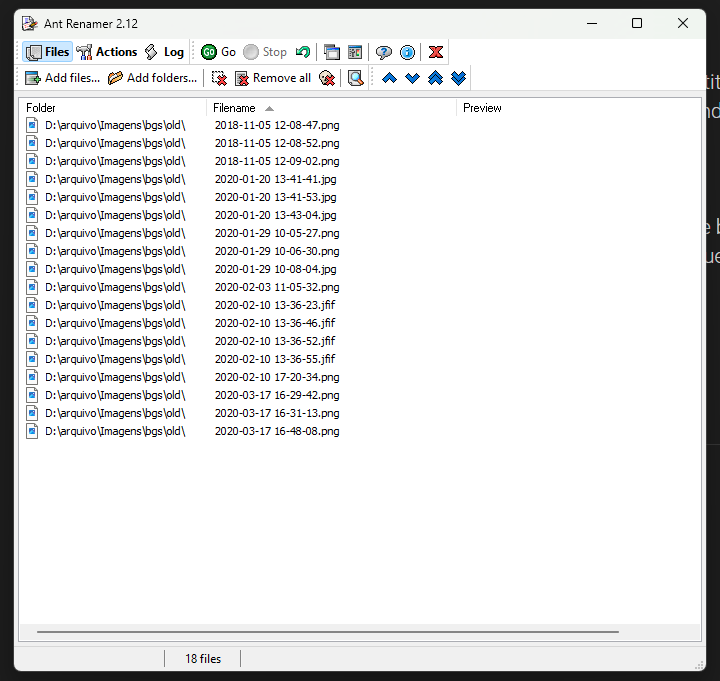
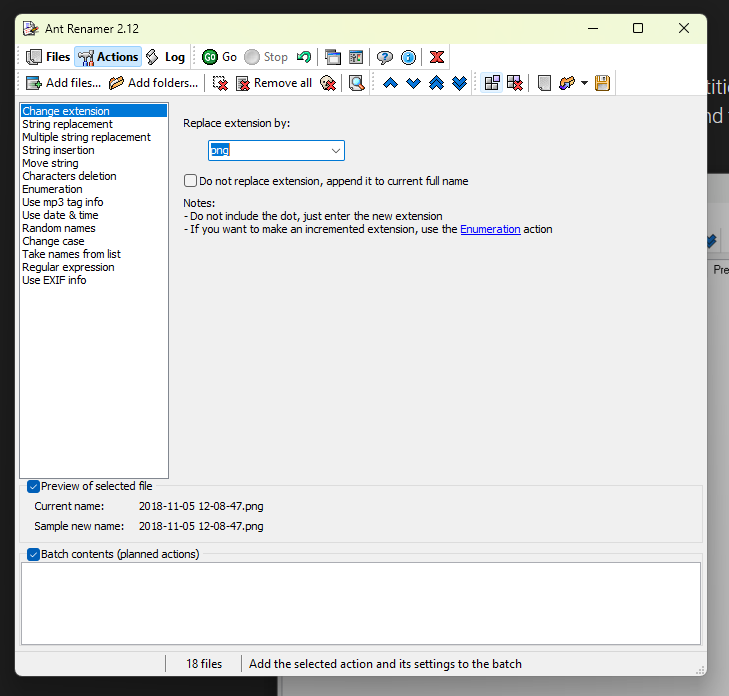
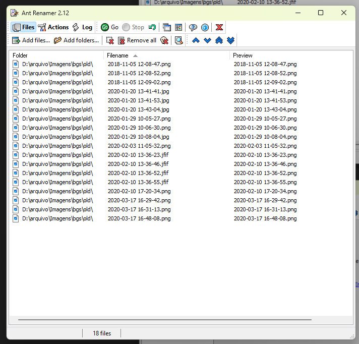
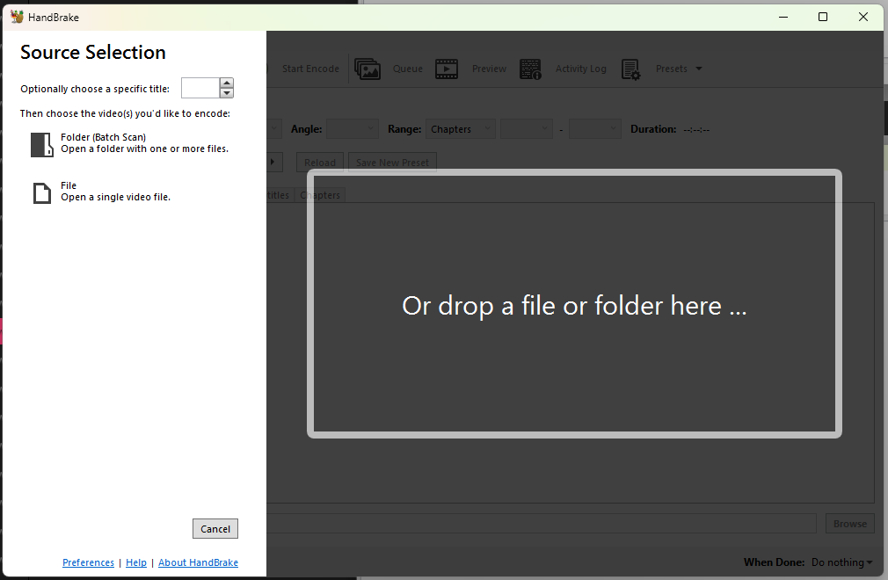
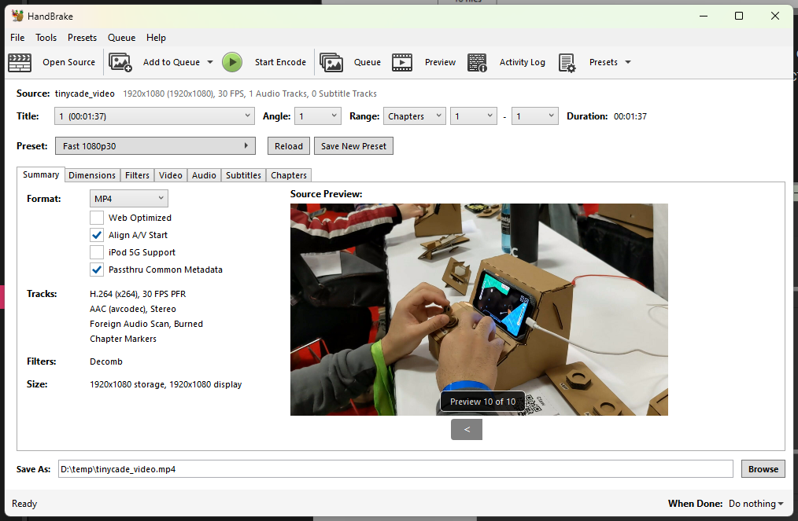
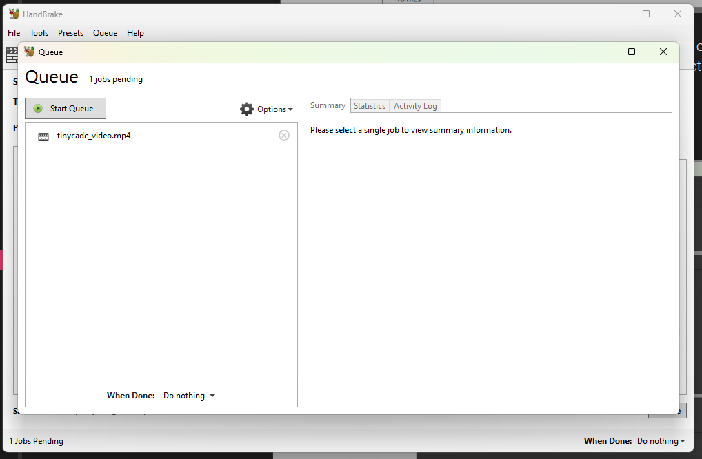

## Inspiration

### Batch conversion apps

These are two apps that have similar functionality, in terms of packaging or operating over a static source and creating a different output.

**ANT Renamer:** used to rename files in large quantities. It works by adding actions to a queue, which the user can preview and then run. I find the back and forth between the `Files` and `Actions` tabs difficult to follow, as the former is also where you can see the preview.

**Handbrake:** video conversion tool, used to change between a variety of codecs, formats and so on. It also features a queue of conversion actions, but uses more of a tabbed UI.

It starts right away at a source selection panel.

After settings are defined, the job is added to a `Queue` panel.

